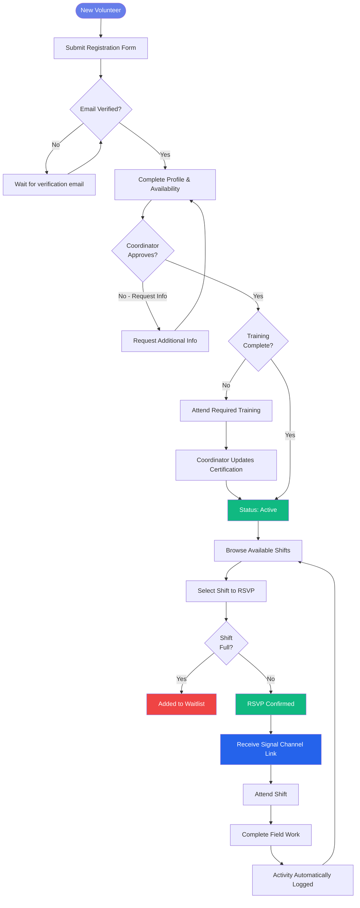
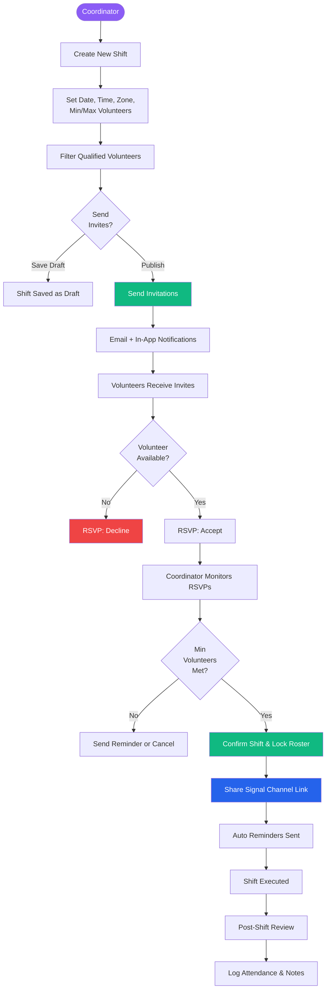
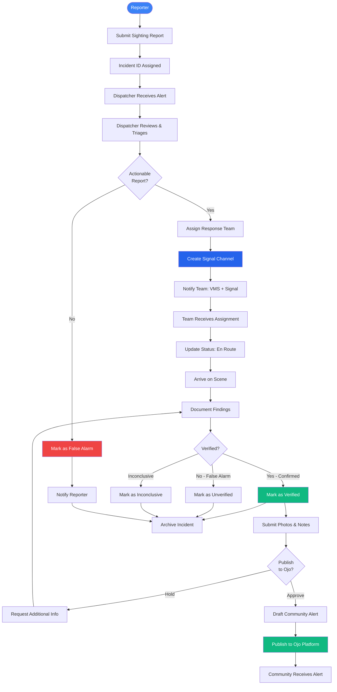
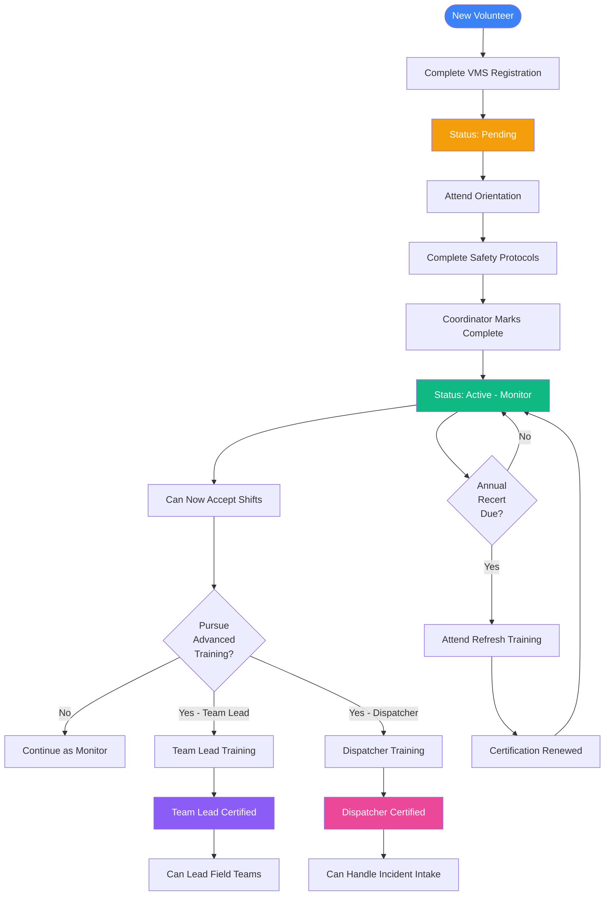

# VMS Workflow Diagrams
**Siembra NC Volunteer Management System**

## Overview

This document provides comprehensive workflow diagrams for all major processes in the VMS. These diagrams show the complete lifecycle of volunteers, shifts, and incidents from initiation through completion.

**Interactive Version:** View the [Interactive HTML Workflow Diagrams](workflows/index.html) for a more detailed, clickable visualization.

---

## Table of Contents

1. [Volunteer Journey Workflow](#1-volunteer-journey-workflow)
2. [Shift Coordination Workflow](#2-shift-coordination-workflow)
3. [Incident Management Workflow](#3-incident-management-workflow)
4. [Training & Certification Workflow](#4-training--certification-workflow)

---

## 1. Volunteer Journey Workflow

Complete lifecycle from registration to active field participation.

### Key Decision Points

| Decision | Outcomes | Notes |
|----------|----------|-------|
| **Email Verified?** | Yes → Profile Setup No → Wait for verification | Automated verification link sent via Resend |
| **Coordinator Approves?** | Yes → Check Training No → Request More Info | Manual review for safety/compliance |
| **Training Complete?** | Yes → Activate No → Schedule Training | Requires orientation + safety protocols |
| **Shift Full?** | Yes → Waitlist No → Confirmed | Based on max capacity setting |

### System Notifications

- **Registration**: Welcome email + verification link
- **Approval**: Account activated + VMS access instructions
- **Shift RSVP**: Confirmation + calendar invite + Signal group link
- **Reminders**: 24h and 2h before shift

---

## 2. Shift Coordination Workflow

Complete process for creating, staffing, and executing volunteer shifts.

### Shift States

| State | Description | Actions Available |
|-------|-------------|-------------------|
| **Draft** | Created but not published | Edit, Delete, Publish |
| **Published** | Invitations sent, accepting RSVPs | Monitor, Remind, Cancel |
| **Confirmed** | Roster locked 24h before | View roster, Share Signal link |
| **Active** | Shift in progress | Real-time updates via Signal |
| **Completed** | Post-shift review | Log attendance, Add notes |

### Notifications

- **Invitation**: Shift details + RSVP link
- **Confirmation**: Calendar invite + Signal channel link
- **Reminders**: 24h and 2h before shift starts
- **Updates**: Shift changes or cancellations

---

## 3. Incident Management Workflow

End-to-end process from sighting report through field verification to Ojo publication.

### Incident Lifecycle

| Status | Description | Next Steps |
|--------|-------------|------------|
| **New** | Just submitted, awaiting triage | Dispatcher reviews within 15 min |
| **Pending Dispatch** | Triaged, awaiting team assignment | Assign available team in zone |
| **Dispatched** | Team assigned and notified | Team updates status via VMS |
| **En Route** | Team traveling to location | Real-time coordination via Signal |
| **On Scene** | Team arrived, investigating | Document findings in VMS mobile |
| **Verified** | Confirmed by field team | Prepare for Ojo publication |
| **Unverified** | False alarm or inconclusive | Archive with notes |
| **Published** | Alert sent to community | Monitor community response |
| **Archived** | Incident closed | Available for analytics |

### Signal + VMS Integration

- **VMS**: Official record, structured data, notifications, Ojo publication
- **Signal**: Real-time encrypted team coordination during active response
- **Handoff**: Dispatcher creates Signal channel when assigning team
- **Documentation**: All findings logged in VMS, Signal used for live updates

---

## 4. Training & Certification Workflow

Volunteer qualification and ongoing professional development.

### Certification Levels

| Level | Requirements | Capabilities | Renewal |
|-------|--------------|--------------|---------|
| **Pending** | Registration submitted | View-only access | N/A |
| **Monitor** | Orientation + Safety Protocols | Accept shifts, report sightings | Annual |
| **Team Lead** | Monitor cert + Team Lead training | Lead field teams, mentor volunteers | Annual |
| **Dispatcher** | Monitor cert + Dispatcher training | Handle incident intake, assign teams | Annual |
| **Coordinator** | Staff role with admin access | Manage volunteers, create shifts | N/A |

### Training Sessions

- **Orientation** (2 hours): VMS overview, mission, values, expectations
- **Safety Protocols** (2 hours): Personal safety, de-escalation, legal rights
- **Team Lead Training** (4 hours): Leadership, coordination, decision-making
- **Dispatcher Training** (4 hours): Incident management, triage, communication
- **Annual Refresh** (1 hour): Policy updates, best practices review

---

## Workflow Characteristics

### Role-Based Access

- **Volunteer**: Submit reports, RSVP to shifts, update profile
- **Coordinator**: Manage volunteers, create shifts, review activity
- **Dispatcher**: Handle incidents, assign teams, coordinate response
- **Administrator**: System configuration, user management, analytics

### Automation Points

1. **Email Verification**: Automated on registration
2. **Shift Reminders**: 24h and 2h before shift
3. **Capacity Tracking**: Auto-update based on RSVPs
4. **Incident Alerts**: Real-time notifications to dispatchers
5. **Activity Logging**: Automatic upon shift completion
6. **Recertification Reminders**: 30 days before expiration

### Integration Touchpoints

- **Signal**: Team coordination channels (incident response, shift coordination)
- **Ojo**: Community alert publication (verified incidents only)
- **Calendar**: Shift confirmations (Google Calendar, iCal)
- **Email**: All notifications (Resend for delivery)

---

## Related Documentation

- **[Interactive Workflow Diagrams](workflows/index.html)** - Detailed HTML visualization with swimlanes
- **[Wireframes](wireframes/index.html)** - Screen mockups for each workflow step
- **[User Roles & Permissions](User%20Roles%20%26%20Permissions.md)** - Complete RBAC specification
- **[Signal Integration Strategy](Signal%20Integration%20Strategy.md)** - VMS + Signal coordination approach
- **[Technical Architecture](Technical%20Architecture.md)** - Implementation details and database schema

---

**Status:** Planning Phase | November 2025

Generated with [Claude Code](https://claude.com/claude-code)
